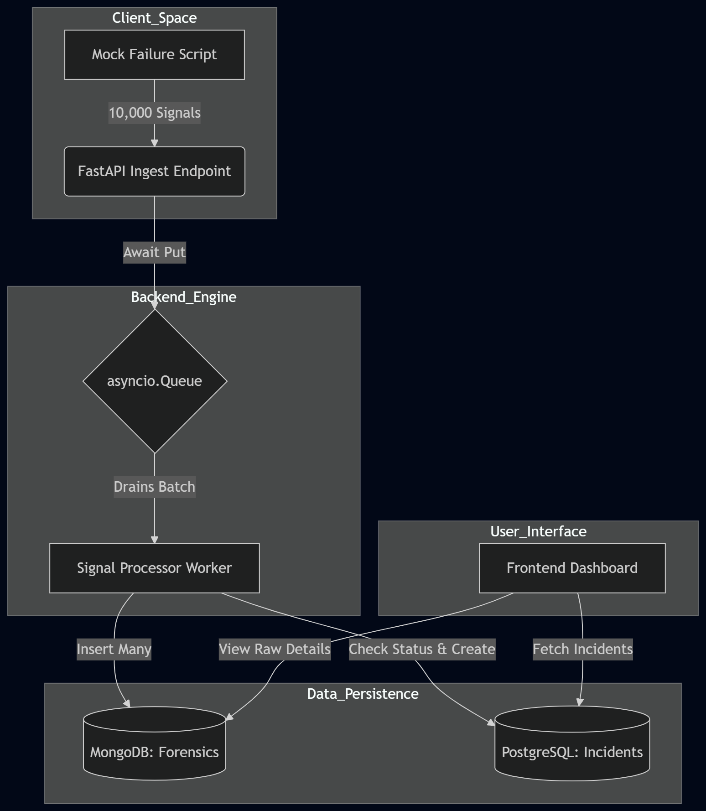

# Mission-Critical Incident Management System (IMS)

## 🚀 Overview
This repository contains a resilient, high-throughput Incident Management System (IMS) designed to monitor distributed stacks. The system is engineered to handle massive signal bursts (10,000+ signals/sec) while maintaining a clear, actionable workflow for incident response and Root Cause Analysis (RCA).

## 🏗️ Technical Architecture
The system employs a decoupled, asynchronous architecture to ensure reliability under heavy load:

*   **Ingestion Layer:** FastAPI handles high-frequency POST requests and pushes signals into an internal `asyncio.Queue`.
*   **Backpressure Management:** The queue acts as a buffer. If the system reaches maximum capacity, it implements a `503 Service Unavailable` response to protect the persistence layer from cascading failure.
*   **Background Worker:** A persistent `signal_processor` worker drains the queue in batches (up to 100 items), optimizing database I/O.
*   **Persistence Strategy:**
    *   **MongoDB (Forensics):** Every raw signal is archived here to provide a full audit trail for post-mortems.
    *   **PostgreSQL (Source of Truth):** Stores deduplicated "Work Items" and transactional RCA records.
    *   **Redis (Hot-Path):** Caches real-time dashboard states to reduce database read pressure.

## ⚖️ SRE Logic & Design Patterns
### 1. Debouncing (Alert Fatigue Suppression)
If multiple signals arrive for the same `component_id` while an incident is already `OPEN`, the system suppresses new ticket creation. This ensures that a burst of 10,000 signals results in only one actionable Work Item in PostgreSQL.

### 2. Mandatory RCA Workflow
The system enforces a strict state machine: `OPEN` → `INVESTIGATING` → `RESOLVED` → `CLOSED`. An incident **cannot** be moved to `CLOSED` unless a valid RCA object (category, fix applied, and prevention steps) is submitted.

### 3. MTTR Calculation
Mean Time To Repair is automatically calculated by measuring the delta between the timestamp of the first ingested signal and the final RCA submission.

## 🛠️ Tech Stack
*   **Backend:** Python 3.10+, FastAPI, SQLAlchemy (Async), Motor (Async MongoDB).
*   **Frontend:** HTML5, CSS3, JavaScript (Dashboard for Live Feed & RCA Forms).
*   **Infrastructure:** Docker, Docker Compose.
*   **Databases:** PostgreSQL 15, MongoDB 8.0, Redis 8.0.

## 🚦 Getting Started

### 1. Prerequisites
*   Docker and Docker Compose installed.

### 2. Configuration
Copy the template environment file:
```bash
cp .env.example .env
```
*Note: The `.env` file is excluded from version control for security.*

### 3. Launch the Stack
```bash
docker compose up --build
```

### 4. Run Simulation (10,000 Signals)
In a separate terminal, run the provided mock script to simulate a high-volume failure event:
```bash
python3 scripts/mock_failure.py
```


## 📊 Observability & Metrics
*   **Health Check:** Access `http://localhost:8000/health`.
*   **Throughput Logs:** The API console prints real-time throughput (signals/sec) every 5 seconds.
*   **Verification:**
    *   **MongoDB Forensics:** `docker exec -it intern-mongodb-1 mongosh --eval "db.getSiblingDB('ims_database').raw_signals.countDocuments()"` (Expect: 10,000)
    *   **Postgres Incidents:** `docker exec -it intern-postgres-1 psql -U postgres -d ims_db -c "SELECT count(*) FROM incidents;"` (Expect: 1-2)

## 📁 Repository Structure
```text
├── backend/            # FastAPI core logic & workers
├── frontend/           # Management dashboard
├── scripts/            # Mock failure simulation scripts
├── docs/               # Architecture diagrams & prompt history
└── docker-compose.yml  # System orchestration
```

## 🛡️ Backpressure & Throughput Handling
To meet the 10,000 signals/sec requirement without crashing the persistence layer, the system implements a **Producer-Consumer pattern**:

1. **In-Memory Buffering:** Incoming signals are immediately placed into an `asyncio.Queue` with a fixed `SIGNAL_QUEUE_SIZE`. This prevents the API from waiting for slow database writes.
2. **Graceful Degradation:** Once the queue reaches capacity, the API returns an `HTTP 503 Service Unavailable`. This protects the system from memory exhaustion (Cascading Failure prevention).
3. **Batch Processing:** The background worker drains the queue using a batching strategy (up to 100 signals at a once). This reduces the I/O overhead on MongoDB and PostgreSQL by a factor of 100x.
4. **Asynchronous Non-Blocking I/O:** Using `Motor` (MongoDB) and `SQLAlchemy+asyncpg` (PostgreSQL) ensures that the event loop is never blocked, allowing the API to remain responsive during heavy bursts.

---
